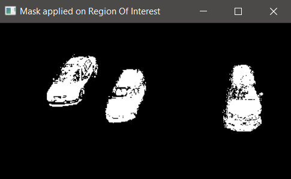
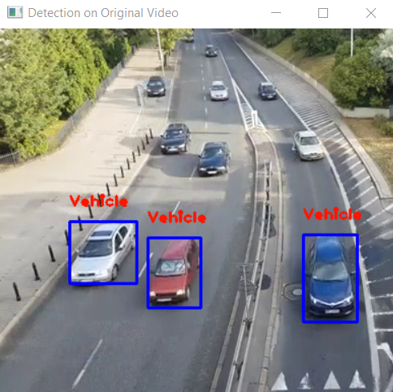

# Object Detection And Tracking

This project aims to detect vehicles on a street or highway using the video feed from a static camera using OpenCV module in Python.

## Removing background

Since the background is static, and the vehicles change position from frame to frame, eliminating the static pixels from the frames can help us detect motion in the video feed. Background Subtractor from CV2 is used to change all static pixels to black.

## Eliminating Noise

Even after applying the background subtractor, some pixels from the static area of the video trigger the motion detection due to some external conditions like lighting, wind, shadows and reflections. To remove this noise, an area filter is used to differentiate between detected vehicles and false positives.

Since the contours on detected vehicles will have a much larger area than the noise, we set a threshold to display these contour detections on the original feed. In case of the example considered here, a value of 200 seems to work well. All the contours that have an area less than 200 will not be displayed.

## Region of Interest

Since the camera feeds often capture a large angle of the street and the surrounding area, some other types of false positives like pedestrians walking on sidewalks or trees moving due to wind might trigger the motion detecting contours. To avoid this, we consider an area of the video where we are sure that only vehicles will be observed and will be observed clearly. Ideally, this should be an area of the street close to the camera through which all vehicles are sure to pass through.

## Output

